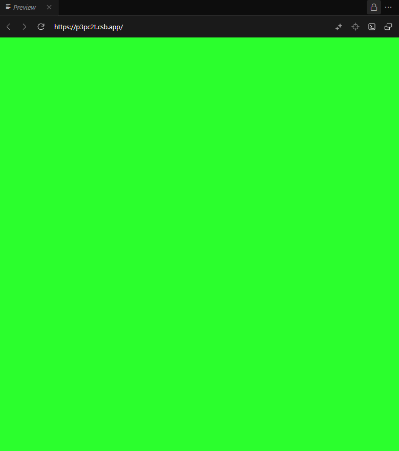
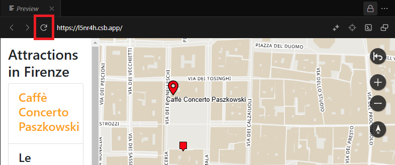

# Oskari RPC workshop

This document guides you through the Oskari RPC workshop describing the steps needed to embed a map to a web page and control it using Oskari RPC functionality. This manual is written for a workshop that has multiple participants but can be used for one's own independent learning, too.

In this workshop we will:

1. Publish a map from https://demo.oskari.org (or other Oskari instance)
2. Embed the map to a web page
3. Add attractions in Firenze to the map
4. Add interaction between the map and the page to get information about the attractions.

The guide has 10 steps in total. At the end, we’ve listed some common errors you might face and their solutions.

You will not need any prior experience on Oskari or coding, yet a basic knowledge of JavaScript or coding in general can provide helpful and give you a bit more insight to the workshop.

## 1. Initial preparations

In this workshop we use a web page called CodeSandbox for the development so you only need a web browser (like Chrome). You don't need to install any software or setup a server.

1. Sign up / log in to [CodeSandbox](https://codesandbox.io) (you can use your GitHub account to sign up)
2. [Open the template project](https://codesandbox.io/s/naughty-sutherland-6142pq) and click `Fork` from the top right corner to copy the template under your own user account in CodeSandbox.

As an example and a starting point the template has a full screen placeholder for a map that is lime green. 



The template also includes helper scripts that will let us skip some of the coding that is not related to Oskari.

You can preview a finished product of what we will be creating here: 
https://codesandbox.io/s/youthful-violet-l5nr4h (created with demo.oskari.org) 

**Note!** If you have some web server running on your laptop you can just as easily use your favorite editor for this workshop. Just run the code on your computer if you have an environment to serve static files for a browser (files opened without a server might not work properly).

The source code for this workshop is available in [GitHub](https://github.com/oskariorg/oskari-docs/tree/master/md/documentation/examples/FOSS4G_2022).

## 2. First look

You should now have a CodeSandbox project that you can edit with files:

- src/helper.js
- src/index.js
- src/main.css
- src/styles.js
- index.html
- package.json
- poi.json ==> this file contains sights from Firenze. You can create your own POI data e.g. with QGIS using the same coordinate system as the embedded map from Oskari (`EPSG:3857` for this instance)

## 3. Adding the map aka "It's not easy being green"

1. Open https://demo.oskari.org or other Oskari instance that allows embedded map functionality
2. Log in using credentials user / user
3. Click `MAP PUBLISHING` on the left panel.
4. Click "Accept and continue" in the pop up window that appears.
5. Insert details about the map:
- Map name: Something that will let you identify your map since we will all use the same user. This is the only compulsory field in the map publishing tool.
- Allowed domain: leave it empty so we don't limit the visibility based on domain
- Pan the map to show Firenze as the attractions are going to be around there. (or leave the map publisher, go back to the main view and use the search bar to find  `Florence Italy` to set the location)
6. Leave the rest of the options of map publishers to default.
7. Click `Save`. A pop up window appears that gives you the HTML code for an iframe of the map we just made. Copy it to your clipboard. 
  

The copied HTML code should look like this:

```html
<iframe src="https://demo.oskari.org/?lang=en&uuid=93235644-944d-466c-85c0-46945f75ff33" allow="geolocation" style="border: none; width: 100%; height: 100%;"></iframe>
```
**Note!** The uuid-parameter value is different for each embedded map so use your own instead of copy-pasting the above.

Alternatively: if you want to skip this phase (ie, the map publishing via demo.oskari.org) you can use our example embedded map instead and control the location and zoom with parameters  `coord` and `zoomLevel`:

```html
<iframe src="https://demo.oskari.org/example?zoomLevel=15&coord=1253022_5429840" allow="geolocation" style="border: none; width: 100%; height: 100%;"></iframe>
```

Next we will add the iframe from Oskari to our CodeSandbox project.

1. Open `index.html` in your CodeSandbox project and replace `<div id="map"></div>` (row 28) with the code for iframe.
2. Add `id="map"` on the `iframe` tag so our styles (in `src/main.css`) affect it. **If you don't add this line, your map won't show in full at the web page.**
   
```html
<iframe 
id="map"
...>
</iframe>
```

3. If you want to customize the page further, you can also change things on `index.html` like the `<title>` and texts on the page under `<body>`. 

## 4. First contact

To interact with the map we need a small JavaScript library called `Oskari RPC client` for the page. For this workshop and for maximum compatibility with CodeSandbox we will hotlink it from oskari.org. 

**Note! In production apps we recommend using the library from official repositories.You can find `Oskari RPC client` in [npm](https://www.npmjs.com/package/oskari-rpc) and [GitHub](https://github.com/oskariorg/rpc-client).**

So, let's hotlink the library from oskari.org. Open the `index.html` again and find the row where it says:

`<!-- Include RPC client library here -->`

From the following row, around the `script`, remove the `<!-- ` and ` -->` tags. That row should now look like this:


```html
<script src="https://oskari.org/js/rpc/rpc-client.min.js"></script>
```


That's the html code so far. Let's take a closer look at the JavaScript.

Open the `src/index.js` file in the editor. Delete the following row:

```javascript
console.log("JavaScript is amazing!");
```

 Add the following (check that the iframe domain is correct if you are using another Oskari instance than demo.oskari.org):
 
```javascript
const IFRAME_DOMAIN = 'https://demo.oskari.org';
const MAP_EL = document.getElementById('map');
const channel = OskariRPC.connect(MAP_EL, IFRAME_DOMAIN);
let metadata;
channel.onReady(function (info) {
    //channel is now ready and listening.
    channel.log('Map is now listening', info);
    // getInfo can be used to get the current Oskari version
    channel.getInfo(function(oskariInfo) {
       channel.log('Current Oskari-instance reports version as: ', oskariInfo);
       metadata = oskariInfo;
    });
});
```

First we initialize a connection to the map. We need to pass `connect()` a reference to the map iframe and give it the domain where the map was published from (the `IFRAME_DOMAIN` must match to the source domain in the iframe). We get a reference to `channel` from the `connect()` that we can use for interacting with the map. Once the connection is made the `onReady()` callback is called on the `channel`.

You can query information about the map "environment" by calling `channel.getInfo()`. Most of the operations on RPC are asynchronous so we will be using callback functions that get called once we have the response. The metadata we get from `getInfo()` includes the coordinate reference system used by the map that we should use when we interact with the map and things like version of the Oskari instance that we are interacting with. 

The Oskari version tells us what version of the API is running on the map and is directly linked to the version of API documentation in:

- <a href="https://oskari.org/documentation/api/requests/3.0.0" target="_blank">https://oskari.org/documentation/api/requests/3.0.0</a>
- <a href="https://oskari.org/documentation/api/events/3.0.0" target="_blank">https://oskari.org/documentation/api/events/3.0.0</a>

Not all the functionalities are available through RPC so there's a filter on the API documentation to show only those requests and events that are relevant to RPC (The "RPC only" checkbox).

Now when you run the app you should see the message `Map is now listening` on developer console of your web browser (opened by F12 on the keyboard). The connection can also be tested without the developer console by adding the following snippet to the `index.js` that opens a pop up window which tells the coordinates of a clicked location:

```javascript
channel.handleEvent('MapClickedEvent', function(data) {
  alert('Map clicked! At ' + data.lon + ', ' + data.lat + ' (' + metadata.srs + ')');
});
```

Now that we are familiar with the basic setup let's start building our own map application showing the attractions!

You can remove the snippet with `MapClickedEvent` from the project as we don't need that after testing everything was ok.

## 5. Add attractions to map

A geoJSON including five attractions in Firenze can be found in the file named `poi.json` in the CodeSandbox project. There is also a helper function that reads the file and returns a Promise-object containing the features (`HELPER.getFeatures()`).

Let's use the RPC request `AddFeaturesToMapRequest` to add the attractions on the map. Open the `src/index.js` file on CodeSandbox and add this snippet to it:

```javascript
const LAYER_ID = 'attractions';
HELPER.getFeatures().then(function(geojson) {
  // add attractions to map
  channel.postRequest('MapModulePlugin.AddFeaturesToMapRequest', [geojson, {
    layerId: LAYER_ID,
    featureStyle: STYLES.normal
  }]);
}).catch(function (err) {
  alert(err);
});
```
We use another helper (`STYLES`) here for shortening the code and using predefined styles for the map. You can find the style definition for the map features in `src/styles.js`. You can find out the styling options [here](https://github.com/oskariorg/oskari-docs/blob/master/md/documentation/examples/oskari-style.md).

Now we can see the attractions on a map but it doesn't give us very much information of them. Let's add a side panel for showing the names and other information of attractions.

## 6. Adding a side panel

The template already includes a navigation element as a placeholder for the side panel. We can modify the CSS a bit to show it. Open `src/main.css` and modify the `left` property under `#map` from 0 to 25%:

```css
#map { 
  /* Map element placement */
  ...
  left: 25%;
  ...
} 
```

After this the map doesn't cover the whole page any more and we have a side panel next to it with a heading 'Attractions in Firenze' (or your custom title if you changed it earlier). However the right side of the map is pushed off-screen and we can fix that by modifying `index.html` by reducing the `iframe` width to 75%:

```html
<iframe ... style="border: none; width: 75%; height: 100%;"></iframe>
```

## 7. List attractions on side panel

We can modify the code where we added attractions to the map (in `src/index.js`) to also add them to the side panel on the page. There's some more helper functions to help you with this. They get you: 
* an easy access to the HTML elements on the page (`HELPER.getFeatureUI()` gives you reference to the side panel)
* an output HTML for a given feature so you don't have to type it in yourself (`HELPER.createFeaturePanel()`)


Each attraction will be listed in it's own collapsible panel so that the information can be seen by clicking the name of the attraction. We add code for populating the side panel to the same getFeatures() handling we used in previous step. 

You should **replace** the previous `HELPER.getFeatures()` functions with the following one:

```javascript
HELPER.getFeatures().then(function(geojson) {
  let listUI = HELPER.getFeatureUI();
  // add attractions to side panel
  geojson.features.forEach(feature => {
    const panel = HELPER.createFeaturePanel(feature);
    listUI.append(panel);
  });
  // add attractions to map
  channel.postRequest('MapModulePlugin.AddFeaturesToMapRequest', [geojson, {
    layerId: LAYER_ID,
    featureStyle: STYLES.normal
  }]);
}).catch(function (err) {
  // this is an error handler in case of network error
  alert(err);
});
```

After this you should see the attractions on the side panel. Now we need to add some functionality to create the link between the side panel and the map.

If you get an error message saying "ReferenceError: LAYER_ID is not defined", see if you have deleted the following from `src/index.js`:

```
  const LAYER_ID = "attractions";
```

## 8. Highlight the attraction on map

Next we will add interaction between the side panel and the map. We want to highlight features on the map when they are clicked on the panel. 

Feature styles can be updated  using the same request as adding features (`AddFeaturesToMapRequest`) but giving a filter object matching feature properties that is used to identify feature(s) to be updated and the updated style. Here we use id to select a single feature as we only want to change the style of one feature.

Let's add a helper function in `src/index.js` to update a style of a feature by id:

```javascript
function setFeatureStyle (id, style) {
  channel.postRequest('MapModulePlugin.AddFeaturesToMapRequest', [{ 'id': id }, {
      layerId: LAYER_ID,
      featureStyle: style
  }]);
}
```

Now let's modify the code that adds attractions to the UI and add a click listener on each attraction panel to update the style of the matching feature. Again, you can **replace** the previous `HELPER.getFeatures()` function with the following one:

```javascript
HELPER.getFeatures().then(function(geojson) {
  let listUI = HELPER.getFeatureUI();
  // add attractions to side panel
  geojson.features.forEach(feature => {
    const panel = HELPER.createFeaturePanel(feature);

    // on click -> update feature style
    panel.on('click', () => setFeatureStyle(feature.properties.id, STYLES.selected));

    listUI.append(panel);
  });
  // add attractions to map
  channel.postRequest('MapModulePlugin.AddFeaturesToMapRequest', [geojson, {
    layerId: LAYER_ID,
    featureStyle: STYLES.normal
  }]);
}).catch(function (err) {
  // this is an error handler in case of network error
  alert(err);
});
```

After this the attractions on a map are highlighted when clicked on the side panel. There's a problem though. The previously highlighted feature is not reset when another is clicked so you will eventually end up with all the features having the highlighted style.

Let's add some more code in `src/index.js` to fix this:

```javascript
let selectedFeature = null;

function featureClicked (id) {
  if (id === selectedFeature) {
    return;
  }
  if (selectedFeature) {
    // reset style on previously selected
    setFeatureStyle(selectedFeature, STYLES.normal);
  }
  // update the selected feature and highlight the feature
  selectedFeature = id;
  setFeatureStyle(id, STYLES.selected);
}
```

Now let's modify the `click` handler on the features loop to use the new function instead of calling `setFeatureStyle()`:

```javascript
    // on click -> update feature style
    panel.on('click', () => featureClicked(feature.properties.id));
```

Now the style of the previously selected feature is reset before new selection is highlighted.

The index.js should now include the following code:

```javascript
import { HELPER } from "./helper";
import { STYLES } from "./styles";

const IFRAME_DOMAIN = "https://demo.oskari.org";
const MAP_EL = document.getElementById("map");
const channel = OskariRPC.connect(MAP_EL, IFRAME_DOMAIN);
let metadata;
channel.onReady(function (info) {
  //channel is now ready and listening.
  channel.log("Map is now listening", info);
  // getInfo can be used to get the current Oskari version
  channel.getInfo(function (oskariInfo) {
    channel.log("Current Oskari-instance reports version as: ", oskariInfo);
    metadata = oskariInfo;
  });
});

/*
channel.handleEvent("MapClickedEvent", function (data) {
  alert(
    "Map clicked! At " + data.lon + ", " + data.lat + " (" + metadata.srs + ")"
  );
});
*/
const LAYER_ID = "attractions";

HELPER.getFeatures()
  .then(function (geojson) {
    let listUI = HELPER.getFeatureUI();
    // add attractions to side panel
    geojson.features.forEach((feature) => {
      const panel = HELPER.createFeaturePanel(feature);

      // on click -> update feature style
      panel.on("click", () => featureClicked(feature.properties.id));

      listUI.append(panel);
    });
    // add attractions to map
    channel.postRequest("MapModulePlugin.AddFeaturesToMapRequest", [
      geojson,
      {
        layerId: LAYER_ID,
        featureStyle: STYLES.normal
      }
    ]);
  })
  .catch(function (err) {
    // this is an error handler in case of network error
    alert(err);
  });

function setFeatureStyle(id, style) {
  channel.postRequest("MapModulePlugin.AddFeaturesToMapRequest", [
    { id: id },
    {
      layerId: LAYER_ID,
      featureStyle: style
    }
  ]);
}

let selectedFeature = null;

function featureClicked(id) {
  if (id === selectedFeature) {
    return;
  }
  if (selectedFeature) {
    // reset style on previously selected
    setFeatureStyle(selectedFeature, STYLES.normal);
  }
  // update the selected feature and highlight the feature
  selectedFeature = id;
  setFeatureStyle(id, STYLES.selected);
}
```

Now we know where the attractions are on a map but what if we want to know which feature on the map is which attraction? We need to react to feature clicks on the map and highlight the matching attraction on the side panel.

## 9. Catching clicks

When a feature is clicked on the map a `FeatureEvent` is triggered. It is also triggered when a feature is added or removed but we want to focus on clicks. The event has an `operation` property to indicate what actually happened. The event also includes any features that were "hit" by the click. Let's listen to `FeatureEvent` and highlight the name of the clicked feature from the side panel.

This snippet should be added to `scripts/index.js`:

```javascript
channel.handleEvent('FeatureEvent', function(data) {
  if (data.operation !== 'click') {
    // we are not interested in features being added or removed
    // so skip if not clicked
    return;
  }
  // filter out features that are not on our vector layer
  // and pick the id from attractions
  let clickedAttractions = data.features
    .filter(feat => feat.layerId === LAYER_ID)
    .map(feat => feat.geojson.features[0].properties.id);

  // if we hit one or more attractions -> select the first one
  if (clickedAttractions.length) {
    featureClicked(clickedAttractions[0]);
  }
});
```
We use the same `featureClicked()` function as before but **add one line: `HELPER.highlightMenu(id);`**.

```javascript
function featureClicked(id) {
  if (id === selectedFeature) {
    return;
  }
  HELPER.highlightMenu(id);

  ... the rest of the function...
}
```
The `highlightMenu()` function highlights the attraction on the side panel and is a part of the helper functions as it's just HTML handling (which is not the focus of this workshop). By using the same function we get the benefit of not needing to care if the feature was clicked on the map or on the menu and can just do the stuff that should happen if an attraction is selected by any means.

Now the `src/index.js` should include the following functions:

```javascript
import { HELPER } from "./helper";
import { STYLES } from "./styles";

const IFRAME_DOMAIN = "https://demo.oskari.org";
const MAP_EL = document.getElementById("map");
const channel = OskariRPC.connect(MAP_EL, IFRAME_DOMAIN);
let metadata;
channel.onReady(function (info) {
  //channel is now ready and listening.
  channel.log("Map is now listening", info);
  // getInfo can be used to get the current Oskari version
  channel.getInfo(function (oskariInfo) {
    channel.log("Current Oskari-instance reports version as: ", oskariInfo);
    metadata = oskariInfo;
  });
});

/*
channel.handleEvent("MapClickedEvent", function (data) {
  alert(
    "Map clicked! At " + data.lon + ", " + data.lat + " (" + metadata.srs + ")"
  );
});
*/

const LAYER_ID = "attractions";
HELPER.getFeatures()
  .then(function (geojson) {
    let listUI = HELPER.getFeatureUI();
    // add attractions to side panel
    geojson.features.forEach((feature) => {
      const panel = HELPER.createFeaturePanel(feature);

      // on click -> update feature style
      panel.on("click", () => featureClicked(feature.properties.id));

      listUI.append(panel);
    });
    // add attractions to map
    channel.postRequest("MapModulePlugin.AddFeaturesToMapRequest", [
      geojson,
      {
        layerId: LAYER_ID,
        featureStyle: STYLES.normal
      }
    ]);
  })
  .catch(function (err) {
    // this is an error handler in case of network error
    alert(err);
  });

function setFeatureStyle(id, style) {
  channel.postRequest("MapModulePlugin.AddFeaturesToMapRequest", [
    { id: id },
    {
      layerId: LAYER_ID,
      featureStyle: style
    }
  ]);
}

let selectedFeature = null;

function featureClicked(id) {
  if (id === selectedFeature) {
    return;
  }
  HELPER.highlightMenu(id);
  if (selectedFeature) {
    // reset style on previously selected
    setFeatureStyle(selectedFeature, STYLES.normal);
  }
  // update the selected feature and highlight the feature
  selectedFeature = id;
  setFeatureStyle(id, STYLES.selected);
}

channel.handleEvent("FeatureEvent", function (data) {
  if (data.operation !== "click") {
    // we are not interested in features being added or removed
    // so skip if not clicked
    return;
  }
  // filter out features that are not on our vector layer
  // and pick the id from attractions
  let clickedAttractions = data.features
    .filter((feat) => feat.layerId === LAYER_ID)
    .map((feat) => feat.geojson.features[0].properties.id);

  // if we hit one or more attractions -> select the first one
  if (clickedAttractions.length) {
    featureClicked(clickedAttractions[0]);
  }
});
```
Our app is almost ready now. We have attractions on the side panel and on the map and we get the information about them no matter how we select them. Next we make it easier to see what attraction the feature is by hovering on it.

## 10. Hovering like there's no tomorrow

To make it easier to identify attractions on the map we are going to show the name of the attraction when the mouse cursor is on top of it. For getting a hover style on the map we need to initialize the layer we are using with `VectorLayerRequest`.

Modify the callback for `channel.onReady()` in `src/index.js` by adding this to the end of the function:

```javascript
channel.onReady(function () {
    // there can be some code at the start of the function that is mostly logging
    // you can remove it or leave it and add this at the end:

    // initialize layer to get hover style on the layer
    channel.postRequest('VectorLayerRequest', [{ 
      layerId: LAYER_ID,
      hover: STYLES.hover
    }]);
});
```

Now you should see a small popup next to an attraction when you move your mouse on top of one.

## Thank you!!

Sources for this workshop: https://github.com/oskariorg/oskari-docs/tree/master/md/documentation/examples/RPC_workshop_2025

Additional resources for pushing forward:

- The official website: https://oskari.org/

Documentation on RPC:
- https://oskari.org/examples/rpc-api/#/
- https://oskari.org/documentation/api/requests/3.0.0
- https://oskari.org/documentation/api/events/3.0.0
- https://github.com/oskariorg/oskari-docs/blob/master/md/documentation/examples/oskari-style.md

Other related pages:
- GitHub: https://github.com/oskariorg
- Chat: https://gitter.im/oskariorg/chat
- Mailing list: Oskari-user@lists.osgeo.org
 
 ## Disclaimers and things to look out for

### 404 - Not found
 
 We will be erasing the database on demo.oskari.org periodically so the embedded maps published today might not be there tomorrow. If your map gets deleted, you will see a "404 - Not found" message on your RPC demo. You might also get the message if you've made a typo in the address of your embedded map. You can setup your own Oskari instance by following the instructions on https://oskari.org/documentation/docs/latest/3-Setup-instructions#Setup-instructions.

### JavaScript code not working

If you encounter errors when typing in JavaScript code, first see if you've copy pasted the code correctly. If the error still appears and you have no prior expertise on JavaScript, you can copy paste the error message to your preferred search engine / AI helper to see how the code could be fixed to function properly.

### Map not functioning as expected

In some cases the map might not function even though the code is correct. For example, the points of interest might disappear when the map is moved or you don't get even the "Map clicked!" pop up window to show up. In these cases the code is usually correct yet the preview window of CodeSandBox hasn't updated the preview window. You can refresh the preview by clicking the Refresh button next to the address bar of the preview widow.



### Notes on further developing RPC-based apps

If you want to use React when building an RPC-based app we have an example of such https://github.com/oskariorg/rpc-client/tree/master/examples/react

 You can follow changes between versions that _might_ break an RPC-based application by checking https://github.com/oskariorg/oskari-frontend/blob/master/api/CHANGELOG.md (also visible as API-documention root). To see the Oskari version of a instance you can use  `channel.getInfo()` in RPC. It's wise to trigger an update email in your app if the expected version changes so you can check that your app wasn't broken by an Oskari version update on the instance you have published your map from. We try to maintain backwards compatibility within reason but can't affect when or how a given Oskari instance is updated.
