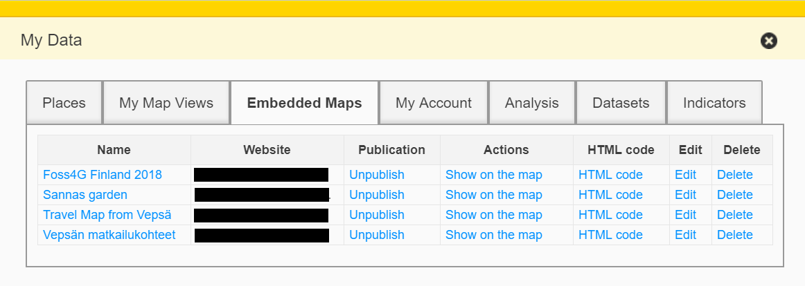

## Embed your map and modify it

Oskari provides a possibility to create embedded maps to your own site. 
This is convenient for private persons and associations which don't have the possibility to create their own map service. 
You can test this feature with Oskari instance that has allowed published maps funcitonality. 

The embedded map can be added to your own web site with iframe code which you can slip between your existing web page html-code. 
When the publishing has been done, you can afterwards change the layers or add features to your published map without changing the code in the web site. 

1. Sign in to your Oskari instance
2. Choose layers you want to publish. Remember, not all dataset lisences allow publishing!
3. Click "Map Publishing"
4. A dialogue for creating embedded maps appears

5. Add your website address without http and www prefixes
6. Add Map Name
7. Choose suitable other parameters, like map sixe, what tools you want to use and how they are placed. You can also add map layers at this point
8. Save your embedded maps
9. Add the iframe-code you receive to your website
10. You can also change information on your published maps through "My data" dialogue

In this video you can see how to create a map view that you can publish on your own site. The screen capture video is done using Paikkatietoikkuna.fi. 

 
